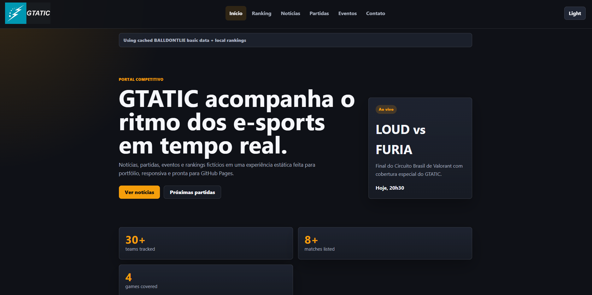

# 🎮 GTATIC

GTATIC is a professional static e-sports portal focused on Counter-Strike 2 (CS2), built with HTML, CSS and vanilla JavaScript.

It was designed as a **portfolio-ready project** that simulates a real-world esports platform, combining modern UI, structured data handling, and resilient architecture — even without a full backend.

---

## 🌐 Live Demo

🔗 https://gtatic.vercel.app

---

## 🖼️ Preview



---

## 💡 About the Project

GTATIC was built to demonstrate how far a **pure front-end application** can go when designed with:

- Structured data architecture
- API integration with fallback strategies
- Realistic product thinking (UX, states, errors, offline handling)

Instead of relying entirely on external APIs, the project uses a **hybrid data system** to ensure reliability and performance.

---

## ⚙️ Features

- 🔄 Hybrid data system (API + local fallback + embedded fallback)
- 📊 Team and player rankings with local assets
- 🖼️ Local image mapping (teams, players, flags)
- 🔍 Search and filtering (rankings, matches, news)
- 📱 Mobile-first responsive design
- 🌙 Dark / Light mode persisted via `localStorage`
- ⚡ API cache system with cooldown handling (429 safe)
- 🧠 Graceful offline fallback ("Using offline data")
- ♿ Accessibility improvements (focus states, labels, semantic HTML)
- 📬 Contact form with validation feedback
- 🔎 SEO + Open Graph meta tags

---

## 🧱 Architecture Highlights

This project does **not depend entirely on APIs**.

### Data loading priority:

1. External API (BALLDONTLIE)
2. Cached API response
3. Local JSON (`/data`)
4. Embedded fallback (`fallback-data.js`)
5. Local assets rendering

This ensures:

- No UI breaks
- Offline usability
- Stable demo experience for recruiters

---

## 🔌 API Integration

GTATIC uses the free tier of the BALLDONTLIE CS2 API.

### Endpoints used:

## 📁 Project Structure

```text
/
|-- assets/
|   |-- flags/
|   |-- icons/
|   |-- images/
|   |-- players/
|   |-- teams/
|   `-- ui/
|-- css/
|   `-- style.css
|-- data/
|   |-- events.json
|   |-- matches.json
|   |-- news.json
|   |-- players.json
|   `-- teams.json
|-- js/
|   |-- api.js
|   |-- fallback-data.js
|   |-- script.js
|   |-- state.js
|   `-- ui.js
|-- pages/
|   |-- contato.html
|   |-- eventos.html
|   |-- noticias.html
|   |-- partidas.html
|   `-- ranking.html
|-- index.html
|-- LICENSE
`-- README.md
```
---
🖼️ Asset Strategy

All images are locally hosted to avoid external dependency issues.

Team logos → /assets/teams
Player images → /assets/players
Flags → /assets/flags
UI elements → /assets/ui

Missing assets fallback gracefully to placeholders.

🧪 Run Locally

Because the project fetches local JSON files, use a static server:

npx serve .

or:

python -m http.server 4173

Then open:

http://127.0.0.1:4173
---
